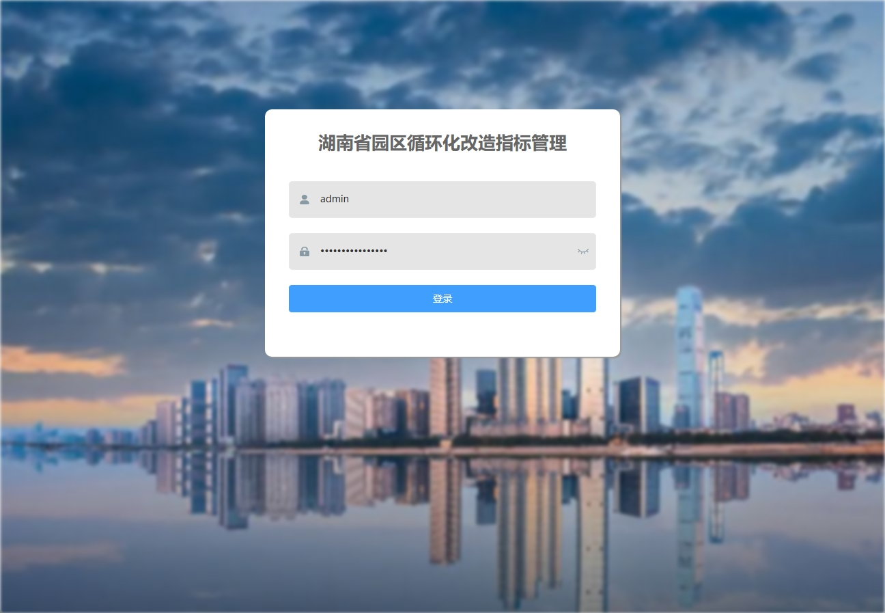
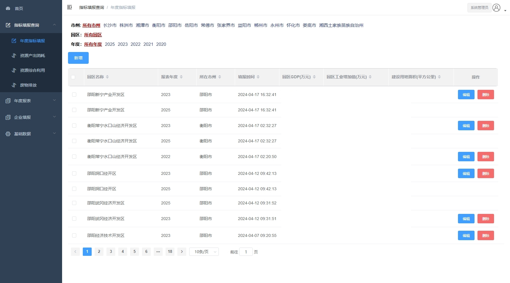
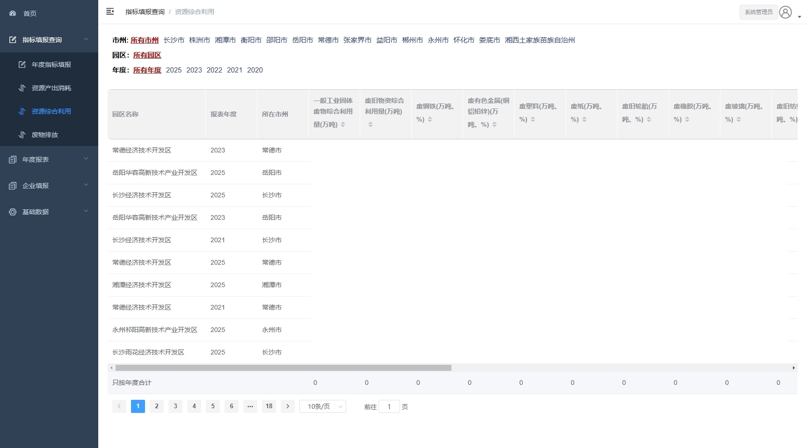
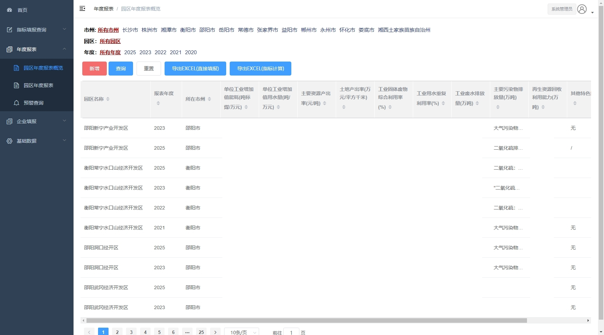
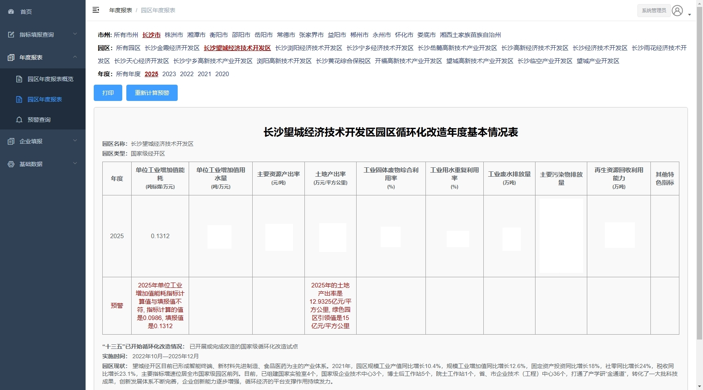

# 湖南省园区循环化改造指标管理平台
管理园区循环化改造指标，包括园区循环化改造指标的申报、审核、预警、查询，生成年度报表等。

## 主要功能
1. 园区使用分配的帐户登录，按年填报各园区循环化改造指标。
2. 系统自动对填报的指标进行审核，计算，预警。
3. 基于某年计算指标的变化情况并预警。
4. 生成园区循环化改造指标年度报告。

## 系统截图
登录页面

年度指标填报页面

资源综合利用指标查询页面
	

园区年度报表概览页面

园区年度报表页面

